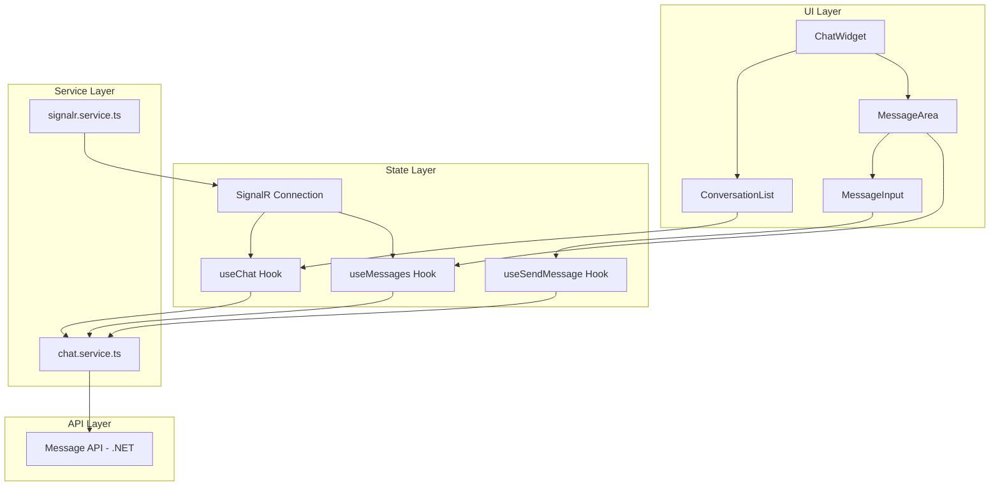

# Design Document: Chat Integration

## Overview

Tích hợp Message API vào ChatWidget component để thay thế mock data bằng dữ liệu thực. Hệ thống sử dụng TanStack Query cho data fetching, SignalR cho real-time messaging, và tuân theo feature-based architecture của project.

## Architecture



## Components and Interfaces

### 1. Types (`src/features/customer/chat/types/chat.types.ts`)

```typescript
// Sender type enum matching API
export enum SenderType {
  User = 1,
  Shop = 2,
}

// Conversation from API
export interface Conversation {
  userId: string;
  userName: string;
  userAvatar: string;
  shopId: string;
  shopName: string;
  shopAvatar: string;
  lastMessage: string;
  seen: boolean;
  createdAt: string;
}

// Message from API
export interface Message {
  id: string;
  content: string;
  createdAt: string;
}

// Chat history response from API
export interface ChatHistoryResponse {
  data: {
    it: Message[]; // Messages from the other party
    me: Message[]; // Messages from current user
  }[];
  currentPage: number;
  pageSize: number;
  totalCount: number;
  totalPages: number;
  hasNextPage: boolean;
  hasPreviousPage: boolean;
  nextPage: number;
  previousPage: number;
}

// Normalized message for UI
export interface NormalizedMessage {
  id: string;
  content: string;
  createdAt: string;
  sender: "me" | "other";
}

// Send message request
export interface SendMessageRequest {
  message: string;
  userId?: string;
  shopId?: string;
  type: SenderType;
}

// Send message response
export interface SendMessageResponse {
  status: boolean;
  message: string | null;
}
```

### 2. Service (`src/features/customer/chat/services/chat.service.ts`)

```typescript
export const chatService = {
  // Get conversations list
  getConversations: (type: SenderType) => Promise<Conversation[]>;

  // Get chat history with pagination
  getChatHistory: (params: {
    userId: string;
    shopId: string;
    type: SenderType;
    page?: number;
    pageSize?: number;
  }) => Promise<ChatHistoryResponse>;

  // Send a message
  sendMessage: (request: SendMessageRequest) => Promise<SendMessageResponse>;
};
```

### 3. Hooks (`src/features/customer/chat/hooks/`)

```typescript
// useConversations - Fetch and manage conversations
export const useConversations = () => {
  // Returns: { conversations, isLoading, error, refetch }
};

// useMessages - Fetch and manage messages with infinite scroll
export const useMessages = (userId: string, shopId: string) => {
  // Returns: { messages, isLoading, fetchNextPage, hasNextPage, isFetchingNextPage }
};

// useSendMessage - Send message mutation
export const useSendMessage = () => {
  // Returns: { sendMessage, isPending, error }
};

// useSignalR - Real-time connection management
export const useSignalR = () => {
  // Returns: { isConnected, connectionStatus }
};
```

### 4. Components Structure

```
src/features/customer/chat/
├── components/
│   ├── ChatWidget.tsx          # Main widget container
│   ├── ConversationList.tsx    # Left sidebar with conversations
│   ├── ConversationItem.tsx    # Single conversation item
│   ├── MessageArea.tsx         # Message display area
│   ├── MessageBubble.tsx       # Single message bubble
│   ├── MessageInput.tsx        # Input area with send button
│   ├── ChatSkeleton.tsx        # Loading skeletons
│   └── index.ts
├── hooks/
│   ├── useConversations.ts
│   ├── useMessages.ts
│   ├── useSendMessage.ts
│   ├── useSignalR.ts
│   └── index.ts
├── services/
│   ├── chat.service.ts
│   ├── signalr.service.ts
│   └── index.ts
├── types/
│   ├── chat.types.ts
│   └── index.ts
├── utils/
│   ├── chat.utils.ts           # Message normalization, sorting
│   └── index.ts
└── index.ts
```

## Data Models

### Message Normalization

API returns messages in two arrays (`it` and `me`). We normalize them into a single sorted array:

```typescript
function normalizeMessages(
  itMessages: Message[],
  meMessages: Message[]
): NormalizedMessage[] {
  const normalized = [
    ...itMessages.map((m) => ({ ...m, sender: "other" as const })),
    ...meMessages.map((m) => ({ ...m, sender: "me" as const })),
  ];
  return normalized.sort(
    (a, b) => new Date(a.createdAt).getTime() - new Date(b.createdAt).getTime()
  );
}
```

### User Type Detection

```typescript
function getSenderType(roles: string[]): SenderType {
  return roles.includes("Shop") ? SenderType.Shop : SenderType.User;
}
```

## Correctness Properties

_A property is a characteristic or behavior that should hold true across all valid executions of a system-essentially, a formal statement about what the system should do. Properties serve as the bridge between human-readable specifications and machine-verifiable correctness guarantees._

### Property 1: API Type Parameter Consistency

_For any_ user with a given role (User or Shop), all API calls (getConversations, getChatHistory, sendMessage) SHALL use the corresponding SenderType value (1 for User, 2 for Shop).
**Validates: Requirements 1.1, 4.1, 4.2, 4.3**

### Property 2: Conversation Display Completeness

_For any_ conversation returned from the API, the rendered conversation item SHALL contain: partner name, partner avatar, last message text, timestamp, and unread indicator (if unread > 0).
**Validates: Requirements 1.3, 1.4**

### Property 3: Message Alignment Correctness

_For any_ normalized message, if the sender is 'me' then the message SHALL be right-aligned, otherwise the message SHALL be left-aligned.
**Validates: Requirements 2.3**

### Property 4: Message Timestamp Display

_For any_ message displayed in the chat area, the rendered output SHALL include a formatted timestamp derived from the message's createdAt field.
**Validates: Requirements 2.5**

### Property 5: Message Normalization Ordering

_For any_ set of messages from API (it[] and me[]), after normalization, the resulting array SHALL be sorted by createdAt in ascending order (oldest first).
**Validates: Requirements 2.1, 2.3**

### Property 6: Empty Message Prevention

_For any_ input string consisting entirely of whitespace characters, the send button SHALL be disabled and form submission SHALL be prevented.
**Validates: Requirements 3.5**

### Property 7: Send Message Payload Structure

_For any_ message sent by a user, the request payload SHALL contain: non-empty message content, correct type based on user role, and the partner's ID (shopId for User, userId for Shop).
**Validates: Requirements 3.1, 4.3**

### Property 8: Optimistic Update Consistency

_For any_ successfully sent message, the message SHALL appear in the conversation immediately after sending, and the input field SHALL be cleared.
**Validates: Requirements 3.3**

### Property 9: Conversation Partner Display

_For any_ conversation displayed to a User, the partner info shown SHALL be shop name and shop avatar. _For any_ conversation displayed to a Shop, the partner info shown SHALL be user name and user avatar.
**Validates: Requirements 4.4**

### Property 10: Real-time Message Integration

_For any_ message received via SignalR, if the message belongs to the active conversation, it SHALL be appended to the message list. If it belongs to a different conversation, the unread count for that conversation SHALL be incremented.
**Validates: Requirements 5.1, 5.2**

### Property 11: Search Filter Behavior

_For any_ search query string, the displayed conversations SHALL only include those where the partner name contains the search string (case-insensitive). When the search string is empty, all conversations SHALL be displayed.
**Validates: Requirements 6.1, 6.3**

### Property 12: Infinite Scroll Pagination

_For any_ message list where hasNextPage is true, scrolling to the top SHALL trigger fetchNextPage, and the older messages SHALL be prepended to the existing list.
**Validates: Requirements 2.4**

## Error Handling

### API Errors

- Network errors: Display toast notification and retry button
- 401 Unauthorized: Redirect to login
- 400 Bad Request: Display error message from API

### SignalR Connection

- Connection lost: Show "Đang kết nối lại..." indicator
- Reconnection failed after 3 attempts: Show "Không thể kết nối" with manual retry button

### Optimistic Updates

- On send failure: Revert optimistic update, show error indicator on message, provide retry option

## Testing Strategy

### Unit Tests

- Test message normalization function with various input combinations
- Test getSenderType utility function
- Test search filter logic

### Property-Based Tests

The project will use `fast-check` library for property-based testing.

Each property test MUST:

1. Be tagged with format: `**Feature: chat-integration, Property {number}: {property_text}**`
2. Run minimum 100 iterations
3. Reference the correctness property from this design document

Property tests to implement:

- Property 1: Generate random user roles, verify API type parameter
- Property 3: Generate random messages, verify alignment
- Property 5: Generate random message arrays, verify sorting
- Property 6: Generate whitespace strings, verify prevention
- Property 7: Generate message payloads, verify structure
- Property 9: Generate conversations with user types, verify display
- Property 11: Generate search queries and conversations, verify filtering

### Integration Tests

- Test conversation list loading and display
- Test message history loading with pagination
- Test send message flow end-to-end
  /
