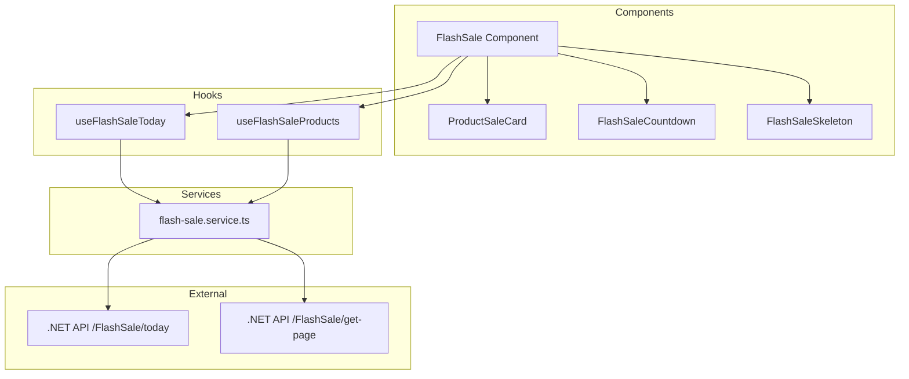

# Design Document: Flash Sale Integration

## Overview

Tính năng Flash Sale Integration thay thế dữ liệu mock hiện tại bằng dữ liệu thực từ API backend. Hệ thống sẽ fetch danh sách Flash Sale trong ngày, lọc ra Flash Sale đang hoạt động, và hiển thị sản phẩm tương ứng với countdown timer chính xác.

## Architecture



## Components and Interfaces

### FlashSale Component (Updated)

```typescript
interface FlashSaleProps {
  // No props needed - fetches data internally
}

// Component responsibilities:
// 1. Fetch Flash Sale list using useFlashSaleToday()
// 2. Find active Flash Sale (status === 1)
// 3. Fetch products using useFlashSaleProducts(flashSaleId)
// 4. Calculate countdown from endTime
// 5. Handle loading/error states
```

### ProductSaleCard Component (Updated)

```typescript
interface ProductSaleCardProps {
  id: string;
  name: string;
  image: string;
  price: number;
  priceDiscount: number;
  percentDecrease: number;
  quantity: number;
  usedQuantity: number;
  reviewCount: number;
  reviewPoint: number;
  slug: string;
  shopName: string;
}
```

### Flash Sale Service

```typescript
// src/features/customer/home/services/flash-sale.service.ts

export const getFlashSaleToday = async (): Promise<FlashSaleToday[]>;
export const getFlashSaleProducts = async (
  flashSaleId: string,
  page?: number,
  pageSize?: number
): Promise<FlashSaleProductsResponse>;
```

### Flash Sale Hooks

```typescript
// src/features/customer/home/hooks/useFlashSale.ts

export const flashSaleKeys = {
  all: ["flash-sale"] as const,
  today: () => [...flashSaleKeys.all, "today"] as const,
  products: (flashSaleId: string) => [...flashSaleKeys.all, "products", flashSaleId] as const,
};

export const useFlashSaleToday = () => useQuery({...});
export const useFlashSaleProducts = (flashSaleId: string, enabled: boolean) => useQuery({...});
```

### Utility Functions

```typescript
// src/features/customer/home/utils/flash-sale.utils.ts

export const findActiveFlashSale = (flashSales: FlashSaleToday[]): FlashSaleToday | null;
export const calculateTimeRemaining = (endTime: string): TimeRemaining;
export const formatTimeValue = (value: number): string;
export const calculateSoldPercentage = (usedQuantity: number, quantity: number): number;
export const isProductSoldOut = (usedQuantity: number, quantity: number): boolean;
```

## Data Models

### API Response Types

```typescript
// src/features/customer/home/types/flash-sale.types.ts

export interface FlashSaleToday {
  flashSaleId: string;
  startTime: string;
  endTime: string;
  status: FlashSaleStatus;
  statusText: string;
}

export enum FlashSaleStatus {
  NotStarted = 0,
  Active = 1,
  Ended = 2,
}

export interface FlashSaleProduct {
  id: string;
  name: string;
  image: string;
  price: number;
  priceDiscount: number;
  percentDecrease: number;
  quantity: number;
  usedQuantity: number;
  reviewCount: number;
  reviewPoint: number;
  boughtCount: number;
  addressShop: string;
  slug: string;
  shopId: string;
  shopName: string;
}

export interface FlashSaleProductsResponse {
  flashSaleId: string;
  startTime: string;
  endTime: string;
  products: FlashSaleProduct[];
}

export interface TimeRemaining {
  hours: number;
  minutes: number;
  seconds: number;
  isExpired: boolean;
}
```

## Correctness Properties

_A property is a characteristic or behavior that should hold true across all valid executions of a system-essentially, a formal statement about what the system should do. Properties serve as the bridge between human-readable specifications and machine-verifiable correctness guarantees._

### Property 1: Active Flash Sale Filtering

_For any_ list of Flash Sales with various statuses, the `findActiveFlashSale` function SHALL return only a Flash Sale with status equal to 1, or null if none exists.

**Validates: Requirements 1.2**

### Property 2: Countdown Time Calculation

_For any_ valid endTime string and current time, the `calculateTimeRemaining` function SHALL return the correct hours, minutes, and seconds remaining, with isExpired=true when endTime is in the past.

**Validates: Requirements 2.1**

### Property 3: Time Value Padding

_For any_ integer value from 0 to 59 (for seconds/minutes) or 0 to 99 (for hours), the `formatTimeValue` function SHALL return a string with exactly 2 characters, padding with leading zero when necessary.

**Validates: Requirements 2.4**

### Property 4: Progress Bar Calculation

_For any_ usedQuantity and quantity where quantity > 0 and usedQuantity <= quantity, the `calculateSoldPercentage` function SHALL return a value between 0 and 100 representing (usedQuantity/quantity)\*100.

**Validates: Requirements 3.3**

### Property 5: Sold Out Detection

_For any_ usedQuantity and quantity, the `isProductSoldOut` function SHALL return true if and only if usedQuantity >= quantity.

**Validates: Requirements 3.4**

## Error Handling

| Scenario                      | Handling Strategy                                 |
| ----------------------------- | ------------------------------------------------- |
| API /FlashSale/today fails    | Hide Flash Sale section, no error shown to user   |
| API /FlashSale/get-page fails | Hide Flash Sale section, no error shown to user   |
| No active Flash Sale          | Hide Flash Sale section                           |
| Empty products list           | Hide Flash Sale section                           |
| Invalid endTime format        | Set countdown to 00:00:00, trigger refetch        |
| Network timeout               | React Query retry (3 attempts), then hide section |

## Testing Strategy

### Unit Tests

Unit tests verify specific examples and edge cases:

- Service functions return correct data structure
- Component renders loading skeleton during fetch
- Component hides when no active Flash Sale
- Navigation to product detail page works correctly

### Property-Based Tests

Property-based tests verify universal properties across all inputs using `fast-check` library.

Each property test MUST:

1. Be tagged with format: `**Feature: flash-sale-integration, Property {number}: {property_text}**`
2. Run minimum 100 iterations
3. Reference the correctness property from design document

Properties to test:

1. `findActiveFlashSale` - filters correctly for any Flash Sale list
2. `calculateTimeRemaining` - calculates correctly for any endTime
3. `formatTimeValue` - pads correctly for any valid time value
4. `calculateSoldPercentage` - calculates correctly for any quantity pair
5. `isProductSoldOut` - detects correctly for any quantity pair

### Test File Location

```
src/features/customer/home/__tests__/
├── flash-sale.utils.test.ts      # Property tests for utility functions
├── flash-sale.service.test.ts    # Unit tests for API service
└── FlashSale.test.tsx            # Component integration tests
```
