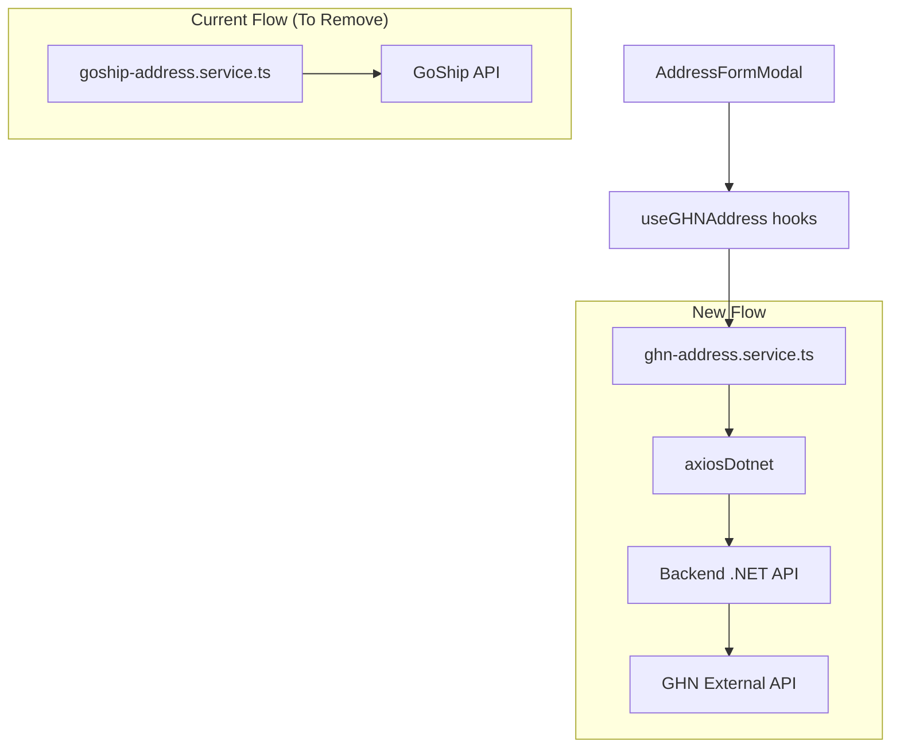

# Design Document

## Overview

Thiết kế này mô tả việc chuyển đổi hệ thống lấy địa chỉ từ GoShip API sang Backend GHN API. Thay đổi chính bao gồm:

1. Tạo mới GHN address service thay thế GoShip service
2. Cập nhật types để match với GHN API response
3. Tạo React Query hooks để caching và fetching
4. Cập nhật AddressFormModal component để sử dụng service mới

## Architecture



## Components and Interfaces

### 1. GHN Address Service

**File:** `src/shared/services/external/ghn-address.service.ts`

```typescript
// API Response Types
interface GHNApiResponse<T> {
  code: number;
  message: string;
  data: T[];
}

// Service Functions
export const getGHNProvinces = async (): Promise<GHNProvince[]>
export const getGHNDistricts = async (provinceId: number): Promise<GHNDistrict[]>
export const getGHNWards = async (districtId: number): Promise<GHNWard[]>
```

### 2. React Query Hooks

**File:** `src/shared/hooks/useGHNAddress.ts`

```typescript
// Query Keys
export const ghnAddressKeys = {
  all: ['ghn-address'] as const,
  provinces: () => [...ghnAddressKeys.all, 'provinces'] as const,
  districts: (provinceId: number) => [...ghnAddressKeys.all, 'districts', provinceId] as const,
  wards: (districtId: number) => [...ghnAddressKeys.all, 'wards', districtId] as const,
}

// Hooks
export const useGHNProvinces = () => useQuery(...)
export const useGHNDistricts = (provinceId: number, enabled: boolean) => useQuery(...)
export const useGHNWards = (districtId: number, enabled: boolean) => useQuery(...)
```

### 3. Updated AddressFormModal

Component sẽ được cập nhật để:

- Import hooks từ `useGHNAddress` thay vì gọi trực tiếp GoShip service
- Sử dụng GHN types cho location options
- Map GHN response fields (provinceID, districtID, wardCode) sang form data

## Data Models

### GHN Province

```typescript
interface GHNProvince {
  provinceID: number;
  provinceName: string;
  code: string;
  updatedSource: string;
}
```

### GHN District

```typescript
interface GHNDistrict {
  districtID: number;
  provinceID: number;
  districtName: string;
  code: string;
  supportType: number;
  type: number;
  updatedSource: string;
}
```

### GHN Ward

```typescript
interface GHNWard {
  wardCode: string;
  districtID: number;
  wardName: string;
  updatedSource: string;
}
```

### Address Form Data Mapping

| Form Field    | GHN Field  | Description           |
| ------------- | ---------- | --------------------- |
| oldProviceId  | provinceID | ID tỉnh/thành phố     |
| oldDistrictId | districtID | ID quận/huyện         |
| oldWardId     | wardCode   | Mã phường/xã (string) |
| newProviceId  | provinceID | ID tỉnh mới (GHN)     |
| newWardId     | wardCode   | Mã phường mới (GHN)   |

## Correctness Properties

_A property is a characteristic or behavior that should hold true across all valid executions of a system-essentially, a formal statement about what the system should do. Properties serve as the bridge between human-readable specifications and machine-verifiable correctness guarantees._

### Property 1: API Response Mapping Preserves Required Fields

_For any_ valid GHN API response (province, district, or ward), the mapping function SHALL preserve all required identifier and name fields without data loss or corruption.

- Province: provinceID and provinceName must be preserved
- District: districtID and districtName must be preserved
- Ward: wardCode and wardName must be preserved

**Validates: Requirements 1.4, 1.5, 1.6**

### Property 2: Cache Key Consistency

_For any_ address data fetch operation, the cache key SHALL uniquely identify the data based on:

- Provinces: global key (no parameters)
- Districts: keyed by provinceId
- Wards: keyed by districtId

Subsequent fetches with the same parameters SHALL return cached data without making new API calls.

**Validates: Requirements 4.1, 4.2, 4.3**

## Error Handling

### API Error Scenarios

| Scenario           | Handling                                               |
| ------------------ | ------------------------------------------------------ |
| Province API fails | Show error toast, allow retry                          |
| District API fails | Show error toast, keep province selection, allow retry |
| Ward API fails     | Show error toast, keep district selection, allow retry |
| Empty response     | Show "Không có dữ liệu" message                        |
| Network error      | Show "Lỗi kết nối" message                             |

### Error Response Structure

```typescript
interface APIError {
  code: number;
  message: string;
}

// Error handling in hooks
onError: (error: AxiosError) => {
  const message =
    error.response?.data?.message || "Không thể tải dữ liệu địa chỉ";
  toast.error(message);
};
```

## Testing Strategy

### Unit Testing

Unit tests sẽ được viết sử dụng Jest và React Testing Library:

1. **Service Tests**: Test các service functions với mocked axios
2. **Hook Tests**: Test React Query hooks với mocked service
3. **Component Tests**: Test AddressFormModal với mocked hooks

### Property-Based Testing

Sử dụng **fast-check** library cho property-based testing trong TypeScript/JavaScript.

Cấu hình: Mỗi property test chạy tối thiểu 100 iterations.

#### Property Tests to Implement

1. **API Response Mapping Property**

   - Generate random valid API responses
   - Verify mapping preserves all required fields
   - Tag: `**Feature: ghn-address-migration, Property 1: API Response Mapping Preserves Required Fields**`

2. **Cache Key Consistency Property**
   - Generate random provinceId/districtId values
   - Verify cache keys are deterministic and unique
   - Tag: `**Feature: ghn-address-migration, Property 2: Cache Key Consistency**`

### Test File Structure

```
src/shared/services/external/__tests__/
  ghn-address.service.test.ts      # Service unit tests
  ghn-address.property.test.ts     # Property-based tests

src/shared/hooks/__tests__/
  useGHNAddress.test.ts            # Hook tests

src/features/customer/checkout/components/__tests__/
  AddressFormModal.test.tsx        # Component tests
```
