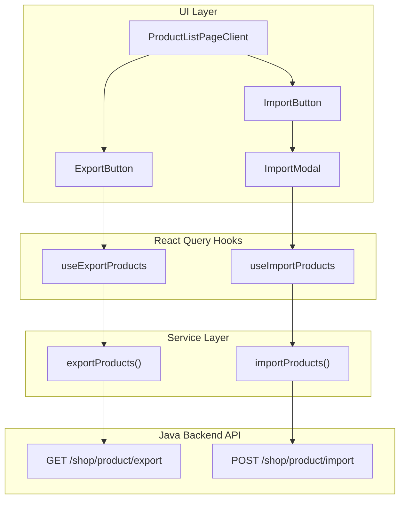

# Design Document: Product Excel Import/Export

## Overview

Tính năng Import/Export Excel cho phép shop owner xuất danh sách sản phẩm ra file Excel và import lại để cập nhật hàng loạt. Tính năng này tích hợp với Java backend API đã có sẵn (`/shop/product/export` và `/shop/product/import`).

### Key Features

- Export tất cả sản phẩm của shop ra file Excel (.xlsx)
- Import file Excel để cập nhật Name, Price, Quantity của variants
- Modal hướng dẫn chi tiết cách import
- Validation file format và hiển thị kết quả import

## Architecture



## Components and Interfaces

### 1. ExportButton Component

```typescript
interface ExportButtonProps {
  onExport: () => void;
  isLoading: boolean;
}
```

- Hiển thị button "Xuất Excel" với icon Download
- Tooltip giải thích chức năng
- Loading state khi đang export

### 2. ImportButton Component

```typescript
interface ImportButtonProps {
  onClick: () => void;
}
```

- Hiển thị button "Nhập Excel" với icon Upload
- Tooltip giải thích chức năng
- Mở ImportModal khi click

### 3. ImportModal Component

```typescript
interface ImportModalProps {
  isOpen: boolean;
  onClose: () => void;
  onImport: (file: File) => void;
  isLoading: boolean;
  result: ImportResult | null;
}

interface ImportResult {
  success: boolean;
  successCount?: number;
  failedCount?: number;
  errors?: string[];
  message?: string;
}
```

- Modal dialog với instructions
- Drag-and-drop file upload area
- File picker button
- Bảng giải thích các cột Excel
- Hiển thị kết quả import (success/error)

### 4. ImportInstructions Component

```typescript
// Stateless component hiển thị hướng dẫn import
```

- 4 bước hướng dẫn
- Bảng giải thích columns
- Lưu ý quan trọng

## Data Models

### API Response Types

```typescript
// Export - trả về file blob
type ExportResponse = Blob;

// Import Response
interface ImportApiResponse {
  error: {
    message: string;
    exception: string;
  } | null;
  content: null;
}

// Parsed Import Result (frontend)
interface ImportResult {
  success: boolean;
  successCount: number;
  failedCount: number;
  errors: string[];
  message: string;
}
```

### Excel File Structure (Reference)

| Column | Name           | Editable | Description        |
| ------ | -------------- | -------- | ------------------ |
| 1      | Product ID     | ❌       | UUID của product   |
| 2      | Name           | ✅       | Tên sản phẩm       |
| 3      | Phân loại hàng | ❌       | Variant properties |
| 4      | Price          | ✅       | Giá variant (>= 0) |
| 5      | Quantity       | ✅       | Số lượng (>= 0)    |
| 6      | Variant ID     | ❌       | ID của variant     |

## Correctness Properties

_A property is a characteristic or behavior that should hold true across all valid executions of a system-essentially, a formal statement about what the system should do. Properties serve as the bridge between human-readable specifications and machine-verifiable correctness guarantees._

### Property 1: File format validation

_For any_ file selected for import, if the file extension is not `.xlsx` or `.xls`, the system should reject the file and display an error message without calling the API.
**Validates: Requirements 2.1, 2.2**

### Property 2: Loading state during export

_For any_ export operation, while the API call is in progress, the export button should display a loading indicator and be disabled.
**Validates: Requirements 1.5**

### Property 3: Loading state during import

_For any_ import operation, while the API call is in progress, the import modal should display a loading indicator and the submit button should be disabled.
**Validates: Requirements 2.5**

### Property 4: Import error parsing

_For any_ API response with partial failures, the system should correctly parse the success count, failed count, and error messages from the response message.
**Validates: Requirements 2.4**

## Error Handling

### Export Errors

| Error         | Handling                                             |
| ------------- | ---------------------------------------------------- |
| Network error | Toast error "Không thể xuất file. Vui lòng thử lại." |
| Unauthorized  | Redirect to login                                    |
| Server error  | Toast error with server message                      |

### Import Errors

| Error             | Handling                                                          |
| ----------------- | ----------------------------------------------------------------- |
| Invalid file type | Show inline error "Chỉ chấp nhận file Excel (.xlsx, .xls)"        |
| File too large    | Show inline error "File quá lớn. Vui lòng chọn file nhỏ hơn 10MB" |
| Network error     | Toast error "Không thể import file. Vui lòng thử lại."            |
| Partial failure   | Show summary in modal with success/failed counts                  |
| Complete failure  | Show error message in modal                                       |

### Error Message Parsing

Backend trả về error message dạng:

```
"Import completed with errors. Success: 5, Failed: 2. Errors: Row 3: Invalid Price format; Row 7: Variant does not belong to this product"
```

Frontend parse thành:

```typescript
{
  success: false,
  successCount: 5,
  failedCount: 2,
  errors: [
    "Row 3: Invalid Price format",
    "Row 7: Variant does not belong to this product"
  ],
  message: "Import completed with errors"
}
```

## Testing Strategy

### Unit Tests

- Test file validation logic (extension check)
- Test error message parsing function
- Test ImportResult parsing from API response

### Property-Based Tests

Library: **fast-check** (đã có trong ecosystem Next.js)

1. **Property 1 Test**: Generate random file names with various extensions, verify only .xlsx/.xls pass validation
2. **Property 4 Test**: Generate random import response messages, verify parsing extracts correct counts and errors

### Integration Tests

- Test export flow triggers correct API call
- Test import flow with mock file upload
- Test modal open/close behavior
- Test loading states

### Manual Testing Checklist

- [ ] Export downloads file with correct name
- [ ] Import modal shows instructions
- [ ] Drag-and-drop works
- [ ] File picker filters Excel files
- [ ] Success message shows after import
- [ ] Error messages display correctly
- [ ] Loading states appear during operations
