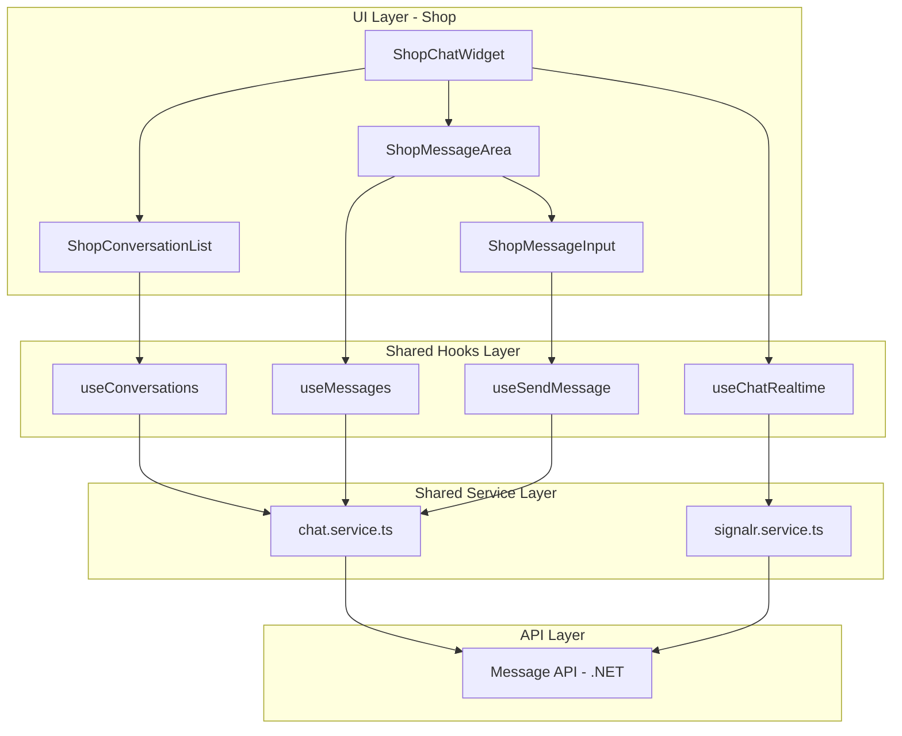

# Design Document: Shop Chat Integration

## Overview

Tích hợp tính năng Chat vào giao diện Shop Management để Shop Owner có thể giao tiếp với khách hàng trong thời gian thực. Hệ thống tái sử dụng các services, hooks và components từ `src/features/customer/chat/` với điều chỉnh `SenderType = 2` (Shop) và logic hiển thị partner là User.

## Architecture



## Components and Interfaces

### 1. Reused from Customer Chat

Các components và hooks sau được tái sử dụng trực tiếp:

- `chat.service.ts` - API calls (đã hỗ trợ type parameter)
- `signalr.service.ts` - Real-time connection (đã hỗ trợ senderType)
- `useConversations` - Fetch conversations (auto-detect senderType)
- `useMessages` - Fetch messages với infinite scroll
- `useSendMessage` - Send với optimistic updates
- `useChatRealtime` - SignalR integration
- `ChatSkeleton` - Loading states
- `MessageBubble` - Message display
- `MessageInput` - Input component

### 2. New Shop-Specific Components

```typescript
// src/features/shop/chat/components/

// ShopChatWidget.tsx - Main chat widget for shop
interface ShopChatWidgetProps {
  // No props needed - uses context and hooks internally
}

// ShopChatContext.tsx - Context for shop chat state
interface ShopChatContextValue {
  isOpen: boolean;
  openChat: () => void;
  closeChat: () => void;
  toggleChat: () => void;
}
```

### 3. Utility Functions

```typescript
// src/features/customer/chat/utils/chat.utils.ts (existing)

// getSenderType - Already handles shop detection via URL path
export function getSenderType(roles: string[]): SenderType {
  if (typeof window !== "undefined") {
    const pathname = window.location.pathname;
    if (pathname.startsWith("/shop/") || pathname === "/shop") {
      return SenderType.Shop; // Returns 2
    }
  }
  return SenderType.User; // Returns 1
}

// getPartnerInfo - Logic for shop (senderType === 2)
// Returns: { name: userName, avatar: userAvatar }
```

## Data Models

### Types (Reused from customer chat)

```typescript
// src/features/customer/chat/types/chat.types.ts

export enum SenderType {
  User = 1,
  Shop = 2, // Used for shop chat
}

export interface Conversation {
  userId: string;
  userName: string; // Partner name for Shop
  userAvatar: string; // Partner avatar for Shop
  shopId: string;
  shopName: string;
  shopAvatar: string;
  lastMessage: string;
  seen: boolean;
  createdAt: string;
}

// SendMessageRequest for Shop
// type: 2, userId: string (no shopId - determined from JWT)
```

### API Endpoints

| Endpoint                 | Method | Shop Parameters                          |
| ------------------------ | ------ | ---------------------------------------- |
| `/Message/conversations` | GET    | `type=2`                                 |
| `/Message/chat`          | GET    | `type=2&userId={userId}&shopId={shopId}` |
| `/Message/send-message`  | POST   | `{ message, type: 2, userId }`           |
| SignalR Hub              | WS     | `?type=2`                                |

## Correctness Properties

_A property is a characteristic or behavior that should hold true across all valid executions of a system-essentially, a formal statement about what the system should do. Properties serve as the bridge between human-readable specifications and machine-verifiable correctness guarantees._

### Property Reflection

After analyzing the prework, the following consolidations were made:

- Properties 5.1, 5.2 (partner display) consolidated into one property
- Properties 1.3, 2.3 (data completeness) are similar patterns
- Properties 3.2, 3.3 (optimistic updates) combined into round-trip property
- Properties 7.1, 7.2 (unread indicators) combined

### Properties

**Property 1: SenderType Detection for Shop**
_For any_ page path starting with `/shop/` or equal to `/shop`, the `getSenderType` function SHALL return `SenderType.Shop (2)`.
**Validates: Requirements 5.3**

**Property 2: Partner Display for Shop**
_For any_ conversation displayed when `senderType === 2`, the partner information SHALL be `{ name: userName, avatar: userAvatar }` (User info, not Shop info).
**Validates: Requirements 5.1, 5.2**

**Property 3: Message Normalization for Shop**
_For any_ message where `senderType === SenderType.Shop`, messages from Shop SHALL be marked as `sender: "me"` and messages from User SHALL be marked as `sender: "other"`.
**Validates: Requirements 5.4**

**Property 4: Conversation Search Filter**
_For any_ search query string, the filtered conversations SHALL only include those where `userName` contains the search string (case-insensitive). When the search string is empty, all conversations SHALL be displayed.
**Validates: Requirements 6.1, 6.2, 6.3**

**Property 5: Empty Message Prevention**
_For any_ string composed entirely of whitespace characters, the send button SHALL be disabled and the message SHALL NOT be sent.
**Validates: Requirements 3.4**

**Property 6: Optimistic Update Round-Trip**
_For any_ message sent, the message SHALL appear immediately in the UI. If the API call fails, the message SHALL be removed from the UI.
**Validates: Requirements 3.2, 3.3**

**Property 7: Unread Count Calculation**
_For any_ list of conversations, the total unread count SHALL equal the number of conversations where `seen === false`.
**Validates: Requirements 7.1, 7.2**

**Property 8: Conversation Read Status Update**
_For any_ conversation selected by the shop owner, that conversation's `seen` status SHALL be updated to `true` in the local cache.
**Validates: Requirements 7.3**

**Property 9: Real-time Message Update**
_For any_ SignalR message received for the active conversation, the message SHALL be appended to the message list without requiring a page refresh.
**Validates: Requirements 4.2**

**Property 10: Non-Active Conversation Update**
_For any_ SignalR message received for a non-active conversation, that conversation's `lastMessage` SHALL be updated and `seen` SHALL be set to `false`.
**Validates: Requirements 4.3**

## Error Handling

### API Errors

| Error Type       | Handling Strategy                                              |
| ---------------- | -------------------------------------------------------------- |
| Network Error    | Display toast "Không thể kết nối đến server" with retry button |
| 401 Unauthorized | Redirect to shop login via ShopGuard                           |
| 400 Bad Request  | Display error message from API                                 |

### SignalR Connection

- Connection lost: Show "Đang kết nối lại..." indicator
- Reconnection failed after 5 attempts: Show "Không thể kết nối" with manual retry button
- Auto-reconnect with exponential backoff: 0s, 2s, 5s, 10s, 30s

### Optimistic Updates

- On send failure: Revert optimistic update, show error indicator on message
- Provide retry option for failed messages

## Testing Strategy

### Unit Tests

- Test `getSenderType` returns `SenderType.Shop` for shop paths
- Test `getPartnerInfo` returns User info when senderType is Shop
- Test search filter logic with various inputs
- Test unread count calculation

### Property-Based Tests

The project will use **fast-check** library for property-based testing.

Each property test MUST:

1. Be tagged with format: `**Feature: shop-chat, Property {number}: {property_text}**`
2. Run a minimum of 100 iterations
3. Reference the correctness property from this design document

**Test Files:**

- `src/features/shop/chat/__tests__/chat.utils.test.ts` - Utility function tests
- `src/features/shop/chat/__tests__/chat.properties.test.ts` - Property-based tests

### Integration Tests

- Test full conversation selection → message fetch → display flow
- Test send message → optimistic update → API response flow
- Test SignalR message receive → cache update flow
