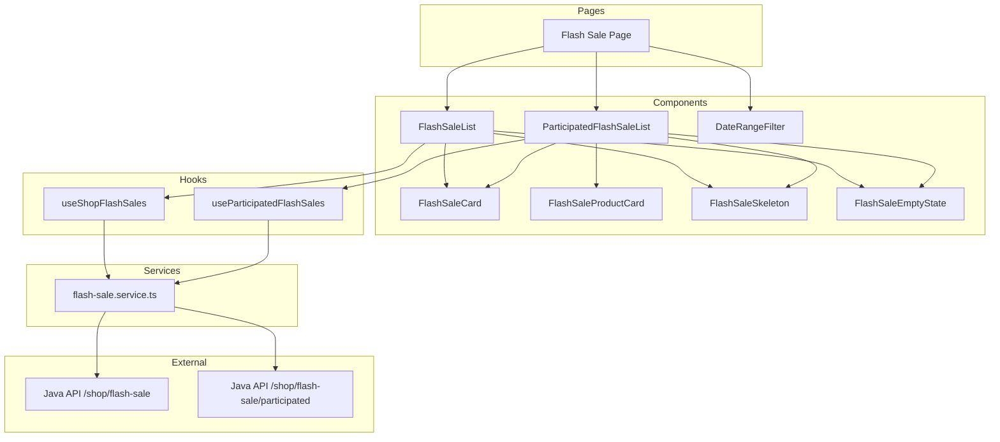

# Design Document: Shop Flash Sale Management

## Overview

Tính năng Shop Flash Sale Management cho phép shop owner xem và quản lý các chương trình Flash Sale. Hệ thống sẽ tích hợp với Java API để lấy danh sách Flash Sale theo khoảng thời gian và danh sách Flash Sale đã tham gia với sản phẩm.

## Architecture



## Components and Interfaces

### Flash Sale Page

```typescript
// src/app/(shop)/shop/flash-sale/page.tsx
// Main page component that orchestrates Flash Sale management
```

### FlashSaleList Component

```typescript
interface FlashSaleListProps {
  startDate: string;
  endDate: string;
}

// Component responsibilities:
// 1. Fetch Flash Sales using useShopFlashSales(startDate, endDate)
// 2. Display list of Flash Sales with status badges
// 3. Handle loading/error/empty states
```

### ParticipatedFlashSaleList Component

```typescript
interface ParticipatedFlashSaleListProps {
  // No props needed - fetches all participated Flash Sales
}

// Component responsibilities:
// 1. Fetch participated Flash Sales using useParticipatedFlashSales()
// 2. Display Flash Sales with their products
// 3. Handle loading/error/empty states
```

### FlashSaleCard Component

```typescript
interface FlashSaleCardProps {
  id: string;
  startTime: string;
  endTime: string;
  status: FlashSaleStatus;
}
```

### FlashSaleProductCard Component

```typescript
interface FlashSaleProductCardProps {
  id: string;
  name: string;
  imgMain: string;
}
```

### DateRangeFilter Component

```typescript
interface DateRangeFilterProps {
  onFilter: (startDate: string, endDate: string) => void;
  defaultStartDate?: string;
  defaultEndDate?: string;
}
```

### Flash Sale Service

```typescript
// src/features/shop/flash-sale/services/flash-sale.service.ts

export const getShopFlashSales = async (
  startDate: string,
  endDate: string
): Promise<ShopFlashSale[]>;

export const getParticipatedFlashSales = async (): Promise<ParticipatedFlashSale[]>;
```

### Flash Sale Hooks

```typescript
// src/features/shop/flash-sale/hooks/useShopFlashSale.ts

export const shopFlashSaleKeys = {
  all: ["shop-flash-sale"] as const,
  list: (startDate: string, endDate: string) =>
    [...shopFlashSaleKeys.all, "list", startDate, endDate] as const,
  participated: () => [...shopFlashSaleKeys.all, "participated"] as const,
};

export const useShopFlashSales = (startDate: string, endDate: string) => useQuery({...});
export const useParticipatedFlashSales = () => useQuery({...});
```

### Utility Functions

```typescript
// src/features/shop/flash-sale/utils/flash-sale.utils.ts

export const formatFlashSaleDateTime = (dateTime: string): string;
export const getStatusColor = (status: FlashSaleStatus): string;
export const getStatusText = (status: FlashSaleStatus): string;
export const isFlashSaleActive = (status: FlashSaleStatus): boolean;
```

## Data Models

### API Response Types

```typescript
// src/features/shop/flash-sale/types/flash-sale.types.ts

export enum FlashSaleStatus {
  NotStarted = 0,
  Active = 1,
  Ended = 2,
}

export interface ShopFlashSale {
  id: string;
  startTime: string;
  endTime: string;
  status: FlashSaleStatus;
}

export interface FlashSaleProduct {
  id: string;
  name: string;
  imgMain: string;
}

export interface ParticipatedFlashSale {
  flashSale: {
    id: string;
    startTime: string;
    endTime: string;
    status: FlashSaleStatus;
  };
  products: FlashSaleProduct[];
}

export interface ShopFlashSaleApiResponse {
  error: {
    message: string;
    exception: string;
  } | null;
  content: ShopFlashSale[];
}

export interface ParticipatedFlashSaleApiResponse {
  error: {
    message: string;
    exception: string;
  } | null;
  content: ParticipatedFlashSale[];
}
```

## Correctness Properties

_A property is a characteristic or behavior that should hold true across all valid executions of a system-essentially, a formal statement about what the system should do. Properties serve as the bridge between human-readable specifications and machine-verifiable correctness guarantees._

### Property 1: Date Time Formatting

_For any_ valid ISO datetime string, the `formatFlashSaleDateTime` function SHALL return a string formatted in Vietnamese locale (dd/MM/yyyy HH:mm).

**Validates: Requirements 3.1**

### Property 2: Status Display Consistency

_For any_ FlashSaleStatus value (0, 1, or 2), the `getStatusColor` function SHALL return the correct color (gray for 0, green for 1, red for 2), and `getStatusText` function SHALL return the correct Vietnamese text.

**Validates: Requirements 1.4, 3.2**

### Property 3: Active Flash Sale Detection

_For any_ FlashSaleStatus value, the `isFlashSaleActive` function SHALL return true if and only if status equals 1.

**Validates: Requirements 3.3**

## Error Handling

| Scenario                                | Handling Strategy                               |
| --------------------------------------- | ----------------------------------------------- |
| API /shop/flash-sale fails              | Display error message with retry button         |
| API /shop/flash-sale/participated fails | Display error message with retry button         |
| No Flash Sales in date range            | Display empty state with helpful message        |
| No participated Flash Sales             | Display empty state with helpful message        |
| Invalid date range                      | Disable submit button, show validation error    |
| Network timeout                         | React Query retry (3 attempts), then show error |

## Testing Strategy

### Unit Tests

Unit tests verify specific examples and edge cases:

- Service functions return correct data structure
- Component renders loading skeleton during fetch
- Component shows empty state when no data
- Date range filter validates input correctly
- Error state displays retry button

### Property-Based Tests

Property-based tests verify universal properties across all inputs using `fast-check` library.

Each property test MUST:

1. Be tagged with format: `**Feature: shop-flash-sale, Property {number}: {property_text}**`
2. Run minimum 100 iterations
3. Reference the correctness property from design document

Properties to test:

1. `formatFlashSaleDateTime` - formats correctly for any valid datetime
2. `getStatusColor` and `getStatusText` - returns correct values for any status
3. `isFlashSaleActive` - detects correctly for any status

### Test File Location

```
src/features/shop/flash-sale/__tests__/
├── flash-sale.utils.test.ts      # Property tests for utility functions
├── flash-sale.service.test.ts    # Unit tests for API service
└── FlashSaleList.test.tsx        # Component integration tests
```
