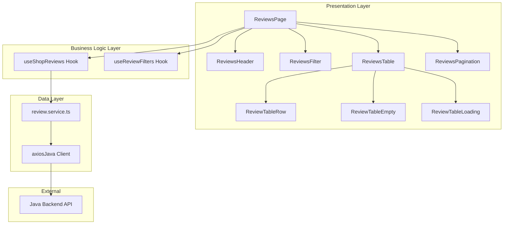

# Design Document: Shop Reviews Management

## Overview

Tính năng "Đánh giá của Shop" cho phép chủ shop xem và quản lý các đánh giá từ khách hàng. Hệ thống sẽ tích hợp với API `/shop/reviews` (Java backend) để lấy dữ liệu đánh giá với các tính năng lọc, tìm kiếm, sắp xếp và phân trang.

## Architecture



## Components and Interfaces

### Page Component

```typescript
// src/app/(shop)/shop/danh-gia/page.tsx
// Server component that renders the reviews management page
```

### Feature Components

```typescript
// src/features/shop/reviews/components/

// ReviewsPage.tsx - Main container component
interface ReviewsPageProps {}

// ReviewsHeader.tsx - Page header with title and stats
interface ReviewsHeaderProps {
  totalReviews: number;
  averageRating: number;
  isLoading: boolean;
}

// ReviewsFilter.tsx - Filter controls (rating, search, sort)
interface ReviewsFilterProps {
  filters: ReviewFilterParams;
  onFilterChange: (filters: ReviewFilterParams) => void;
}

// ReviewsTable.tsx - Table displaying reviews
interface ReviewsTableProps {
  reviews: Review[];
  isLoading: boolean;
}

// ReviewTableRow.tsx - Single review row
interface ReviewTableRowProps {
  review: Review;
}

// ReviewTableEmpty.tsx - Empty state component
interface ReviewTableEmptyProps {}

// ReviewTableLoading.tsx - Loading skeleton
interface ReviewTableLoadingProps {
  rows?: number;
}

// ReviewsPagination.tsx - Pagination controls
interface ReviewsPaginationProps {
  pagination: PageInfo;
  onPageChange: (page: number) => void;
  onPageSizeChange: (size: number) => void;
}
```

### Hooks

```typescript
// src/features/shop/reviews/hooks/

// useShopReviews.ts - Data fetching hook
export const useShopReviews = (filters?: ReviewFilterParams) => {
  return useQuery({
    queryKey: shopReviewKeys.list(filters || {}),
    queryFn: () => getReviews(filters),
    staleTime: 1 * 60 * 1000,
    gcTime: 5 * 60 * 1000,
  });
};

// useReviewFilters.ts - Filter state management with URL sync
export const useReviewFilters = () => {
  // Manages filter state and syncs with URL search params
  // Returns: { filters, setRatingFilter, setSearchTerm, setSortOption, setPage }
};
```

### Services

```typescript
// src/features/shop/reviews/services/review.service.ts

export const getReviews = async (
  params?: ReviewFilterParams
): Promise<ReviewResponse> => {
  const queryParams = new URLSearchParams();
  // Build query params from filters
  // Handle Spring Filter syntax for rating, search
  const response = await axiosJava.get<ReviewResponse>(
    `/shop/reviews?${queryParams.toString()}`
  );
  return response.data;
};
```

## Data Models

### Types

```typescript
// src/features/shop/reviews/types/review.types.ts

export interface ReviewUser {
  name: string;
  avatar: string | null;
}

export interface ReviewVariant {
  id: string;
  name: string;
  price: number;
  image: string | null;
}

export interface Review {
  id: number;
  rating: number;
  content: string;
  urlImg: string | null;
  user: ReviewUser;
  variant: ReviewVariant;
  createdAt: string;
}

export interface PageInfo {
  page: number;
  size: number;
  pages: number;
  total: number;
}

export interface ReviewResponseContent {
  info: PageInfo;
  response: Review[];
}

export interface ReviewResponse {
  error: any;
  content: ReviewResponseContent;
}

export interface ReviewFilterParams {
  page?: number;
  size?: number;
  sort?: string;
  filter?: string;
  // Derived filter values (used to build Spring Filter string)
  rating?: number | null;
  search?: string;
}

export type SortOption =
  | "createdAt,desc"
  | "createdAt,asc"
  | "rating,desc"
  | "rating,asc";
```

### API Filter Building

```typescript
// Build Spring Filter string from filter params
export const buildReviewFilter = (params: ReviewFilterParams): string => {
  const conditions: string[] = [];

  if (params.rating) {
    conditions.push(`rating : ${params.rating}`);
  }

  if (params.search) {
    // Case-insensitive search in content or user name
    conditions.push(
      `(content ~~ '${params.search}' or user.name ~~ '${params.search}')`
    );
  }

  return conditions.join(" and ");
};
```

## Correctness Properties

_A property is a characteristic or behavior that should hold true across all valid executions of a system-essentially, a formal statement about what the system should do. Properties serve as the bridge between human-readable specifications and machine-verifiable correctness guarantees._

### Property Reflection

After analyzing the prework, the following redundancies were identified and consolidated:

- Properties 2.2, 2.3, 4.3, 5.4 (URL state sync) are consolidated into a single round-trip property
- Properties 4.1 and 4.2 (sorting) are combined into one comprehensive sort property
- Properties 6.1 and 6.2 (statistics) are combined into one statistics calculation property

### Properties

**Property 1: Review data completeness**
_For any_ review object returned from the API, the rendered review row SHALL contain the rating, content, customer name, variant name, and creation timestamp.
**Validates: Requirements 1.2**

**Property 2: Rating filter correctness**
_For any_ rating filter value (1-5), all reviews returned by the API SHALL have a rating equal to the selected filter value.
**Validates: Requirements 2.1**

**Property 3: Search filter correctness**
_For any_ search term, all reviews returned SHALL contain the search term (case-insensitive) in either the content or customer name.
**Validates: Requirements 3.1**

**Property 4: Sort order correctness**
_For any_ sort option (createdAt or rating, asc or desc), the reviews SHALL be ordered according to the selected criteria and direction.
**Validates: Requirements 4.1, 4.2**

**Property 5: Pagination state preservation**
_For any_ combination of filters and sort options, navigating to a different page SHALL maintain the current filter and sort settings.
**Validates: Requirements 5.3**

**Property 6: Filter URL round-trip**
_For any_ filter state (rating, search, sort, page), serializing to URL params and parsing back SHALL produce the same filter state.
**Validates: Requirements 2.2, 2.3, 4.3, 5.4**

**Property 7: Statistics calculation correctness**
_For any_ set of reviews, the displayed total count SHALL equal the number of reviews, and the average rating SHALL equal the arithmetic mean of all ratings.
**Validates: Requirements 6.1, 6.2**

**Property 8: Pagination visibility**
_For any_ response where total reviews exceed page size, pagination controls SHALL be visible.
**Validates: Requirements 5.1**

## Error Handling

| Error Type                       | Handling Strategy                          |
| -------------------------------- | ------------------------------------------ |
| 401 Unauthorized                 | Redirect to login page via ShopGuard       |
| 400 Bad Request (invalid filter) | Show toast error, reset to default filters |
| Network Error                    | Show error state with retry button         |
| Empty Response                   | Show empty state component                 |

## Testing Strategy

### Unit Tests

- Test `buildReviewFilter` function with various input combinations
- Test filter URL serialization/deserialization
- Test statistics calculation (average rating)

### Property-Based Tests

The project will use **fast-check** library for property-based testing in TypeScript.

Each property-based test MUST:

1. Be tagged with format: `**Feature: shop-reviews, Property {number}: {property_text}**`
2. Run a minimum of 100 iterations
3. Reference the correctness property from this design document

**Test Files:**

- `src/features/shop/reviews/__tests__/review.service.test.ts` - Service layer tests
- `src/features/shop/reviews/__tests__/review.utils.test.ts` - Utility function tests
- `src/features/shop/reviews/__tests__/review.properties.test.ts` - Property-based tests

### Integration Tests

- Test full filter → API call → render flow
- Test pagination navigation
- Test URL state synchronization
